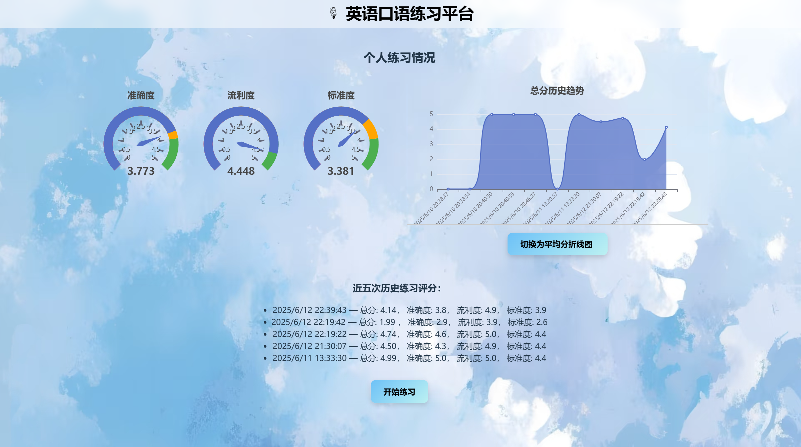
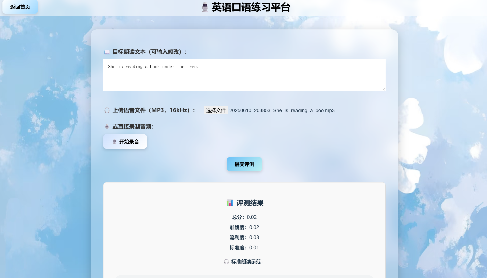
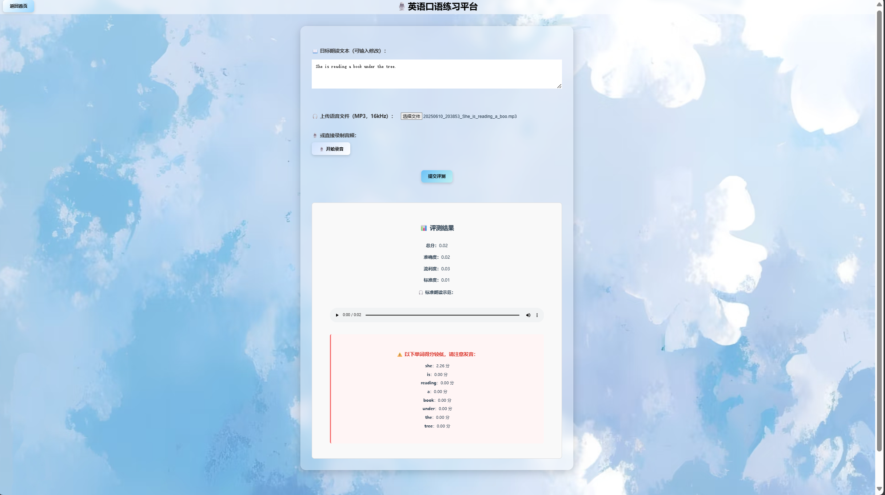

# 🎙️ English Speaking Practice Platform


- A modern web application for practicing English speaking skills.


## Features

* **Audio Upload & Recording**: Upload MP3 audio or record speech directly in-browser.
* **Editable Target Text**: Modify the reading text before evaluation.
* **Speech Evaluation**: Real-time scoring of pronunciation accuracy, fluency, and standardness using voice recognition APIs.
* **Visual Feedback**: Interactive dashboard with:

  * Gauge charts (Accuracy, Fluency, Standardness)
  * Line charts showing total or average scores over time
*  **History Tracking**: Displays the last 5 sessions with detailed scores.
*  **Session Switching**: Seamless navigation between homepage and evaluation interface.

## Tech Stack

* **Frontend**: [Vue 3](https://vuejs.org/) + [Vite](https://vitejs.dev/)
* **Charts**: [ECharts](https://echarts.apache.org/)
* **Audio Evaluation**: Integrated with [iFLYTEK ISE](https://www.xfyun.cn/services/eval) API
* **Backend (optional)**: Node.js / Flask for proxying evaluation services 

## Project Structure

```
vue-frontend/
  src/
  ├── assets/                # Icons, logos
  ├── components/            # Vue components (Home.vue, EvaluateForm.vue)
  ├── App.vue                # Main application
  ├── main.js                # App entry
  public/
  ├── favicon.png           # App icon
  ├── background.png        # Background icon
  index.html                # HTML template
app.py                    # Platform Backend
tts_synthesizer.py        # Standard text to speech module 
README.md

```

## Setup Instructions

```bash
# Clone the repository

# Install dependencies
npm install
npm install recorder-core
npm install vue-router
npm install echarts

# Run in development mode
phthon app.py

vue-fronted
npm run dev

# Build for production
npm run build
```

## Environment Variables 

* Configure Iflytek ISE parameters:

```env
HOST_URL = "ws://ise-api.xfyun.cn/v2/open-ise"
APPID = "5e11538f"
API_SECRET = "ff446b96b01252f80331ae6e4c64984a"
API_KEY = "91205afe0d17e38c61be35fca346503c"
```

## Demo Screenshot







## Contributors

* **李雪菲** – Frontend Design(Home.vue)
* **乐雨晗** – Frontend Design(EvaluateForm.vue)
* **董钰洁** – Backend Design
